# GeoPrevent
 
Um projeto desenvolvido para a global solution Space Connect do primeiro semestre de 2026 da FIAP (Faculdade de Informática e Administração Paulista)

## Telas
 
Widgets reutilizados em todas as telas AppBar, Drawer , BottomNavigationBar(novo),Icons (no BottomNavigationBar) e SwitchListTile (no Drawer)

Widgets novos utilizados BottomNavigationBar,SwitchListTile,InkWell,CheckboxListTile,RadioListTile,ColorFiltered,DropdownButton,DropdownMenuItem,LinearProgressIndicator

Estruturas de pasta "images" para imagens, "components" para os Widgets que vão ser utilizados nas paginas (não todos), "data" para guardar classes e carregar uma lista delas, "screens" para as telas do projeto, "theme" para guardar o theme que o aplicativo deve ficar em cada modo, "main" classe onde vai ser responsável pela troca de modo escuro e claro e navegação entre as telas

## Tela home

Home do aplicativo, com logo e contexto do aplicativo
 

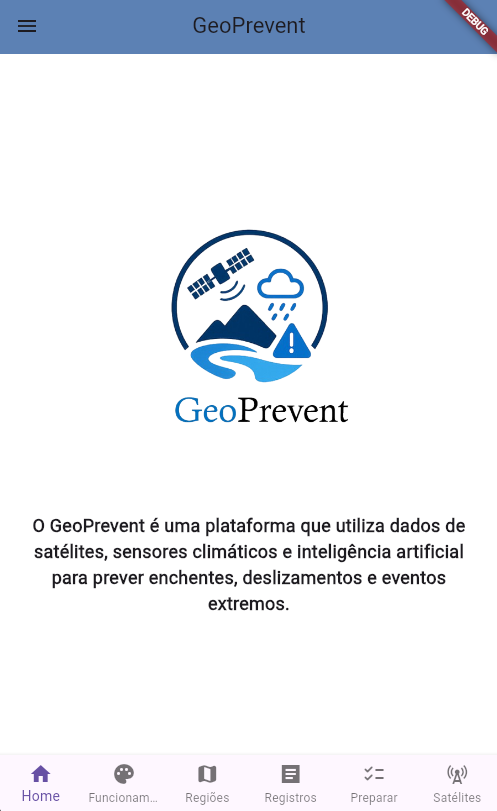
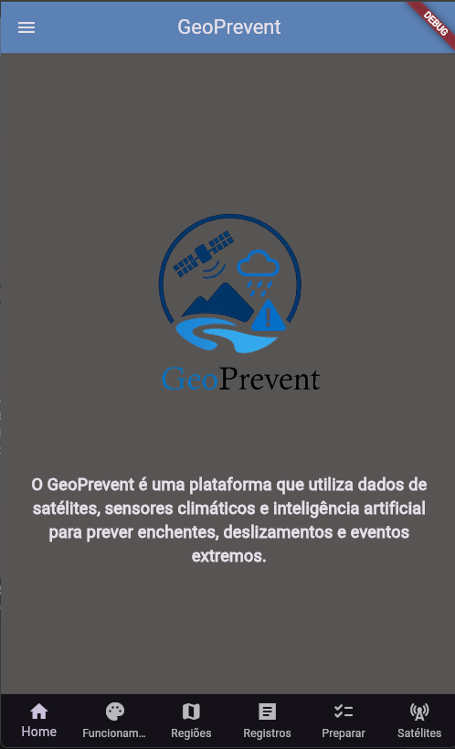
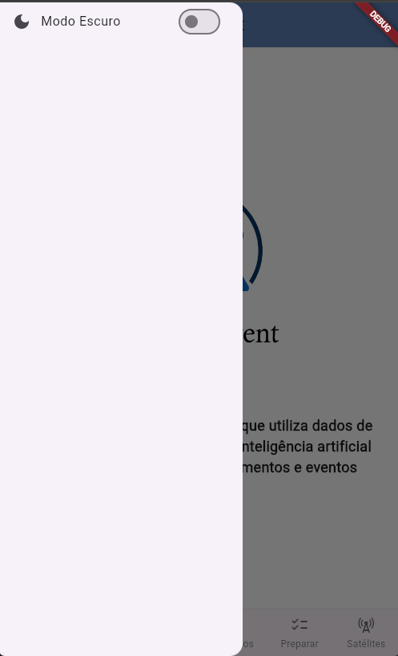
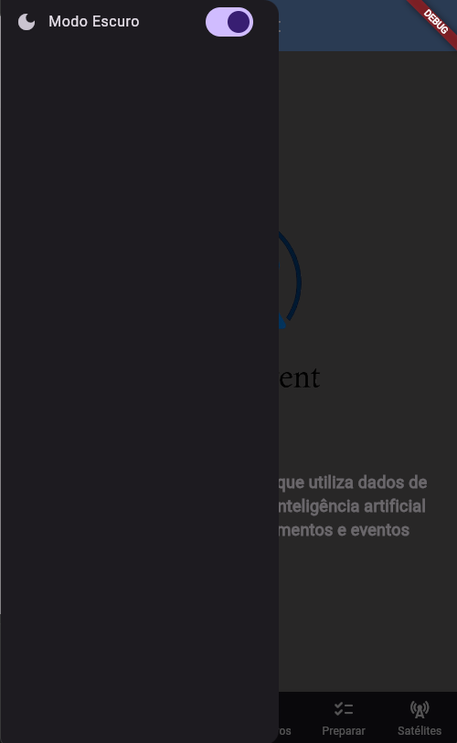

## Tela Funcionamento

Tela explicando como funciona a avaliação do nível de risco de cada região e mostrando com um setState como o mapa da região fica com um filtro de cor verde,amarelo,laranja ou vermelho a depender do nível de risco, quanto maior risco mais avermelhado, quanto menor mais esverdeado

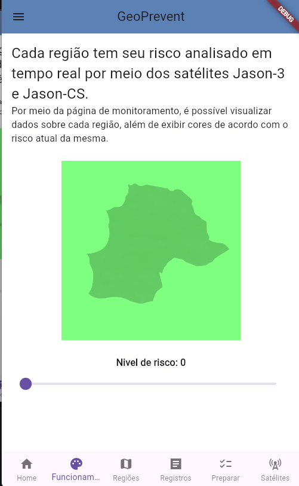
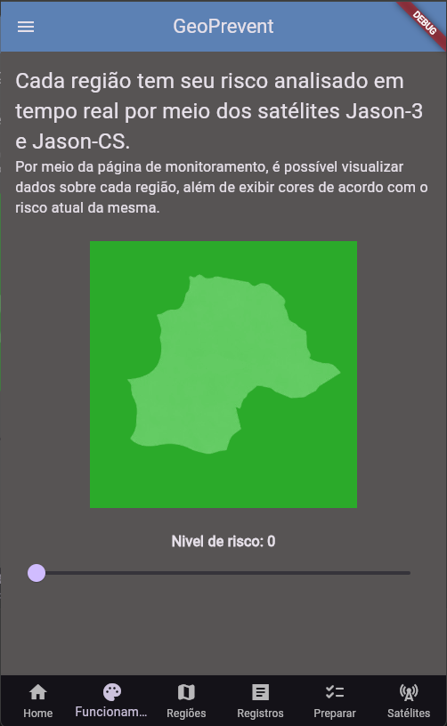
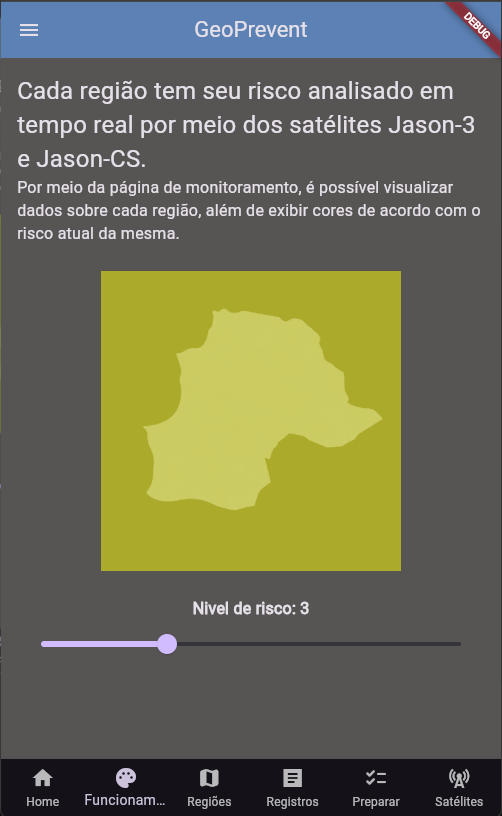
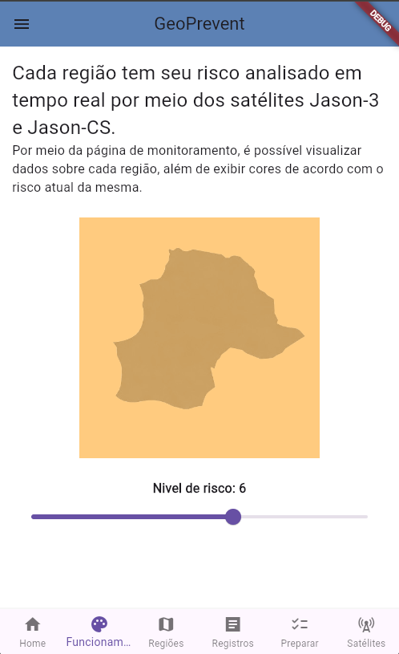
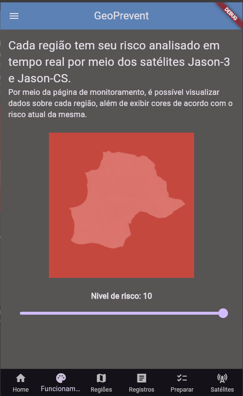

## Tela regiões

Tela com card clicavel utilizando o Widget InkWell, você clica na região que você quer ver mais detalhes e ele usa um setState para mostrar em baixo as imformações 

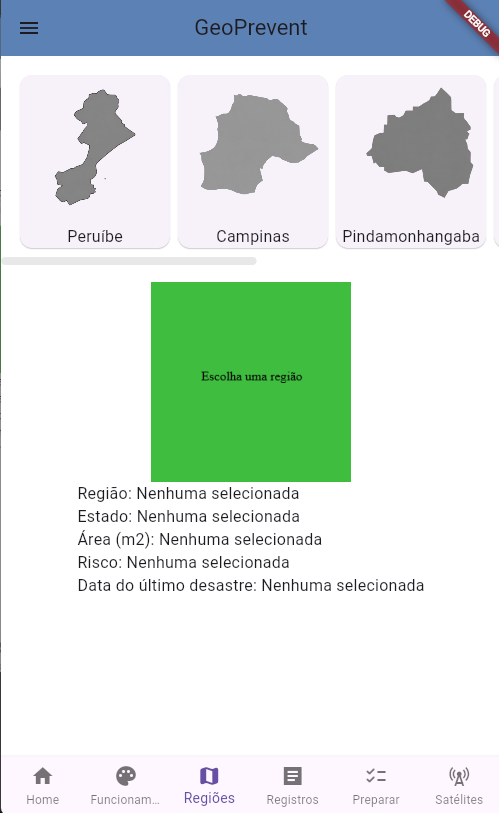
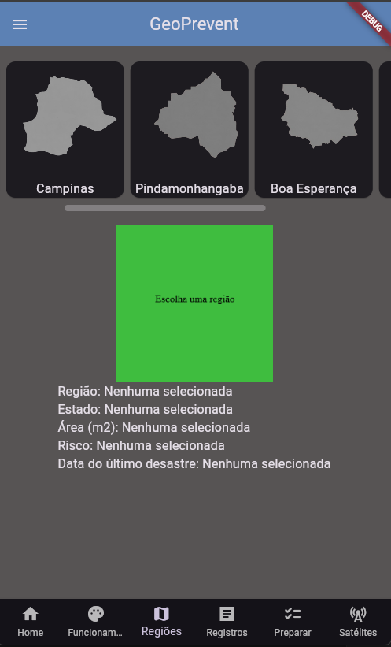
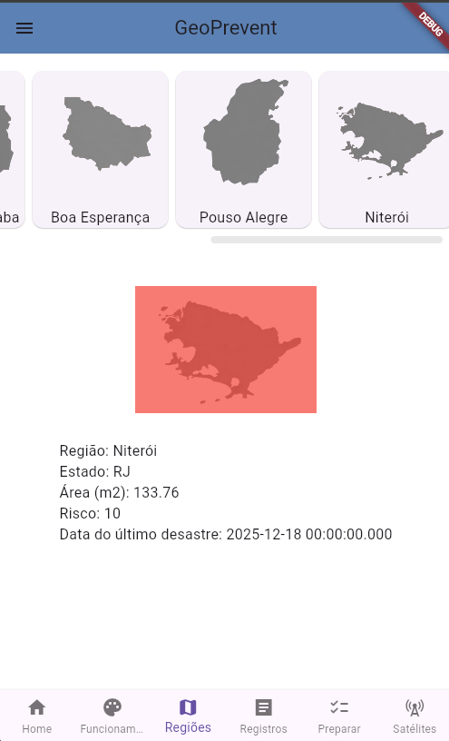
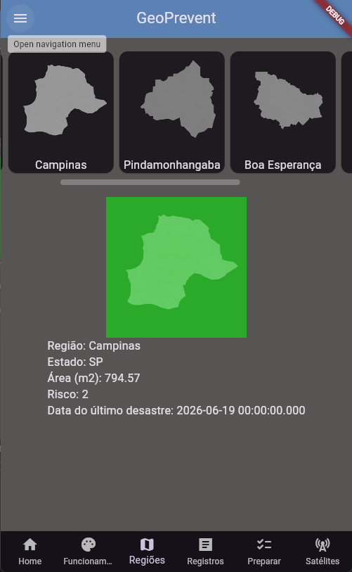

## Tela registros

tela com um dropdown para escolher a região, escohendo a região aparecerá cards com os registros dessa região

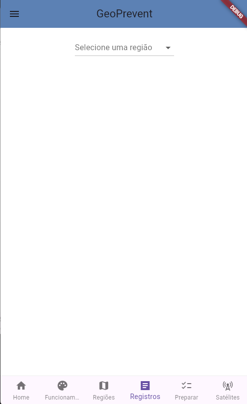
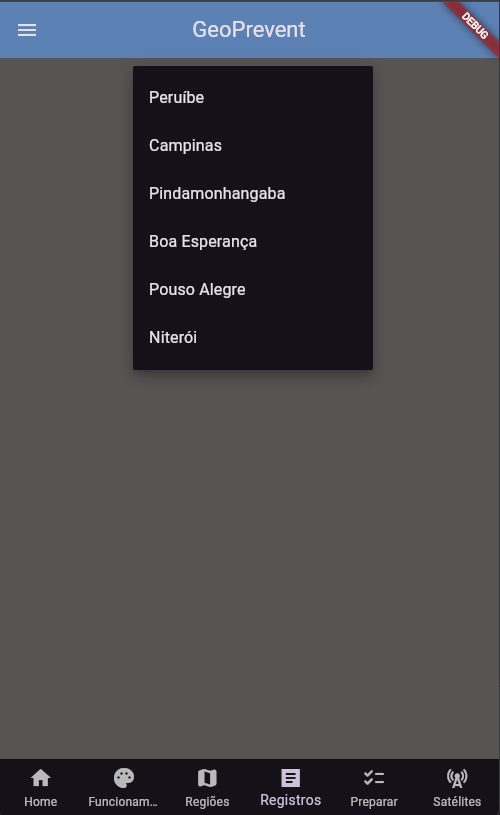
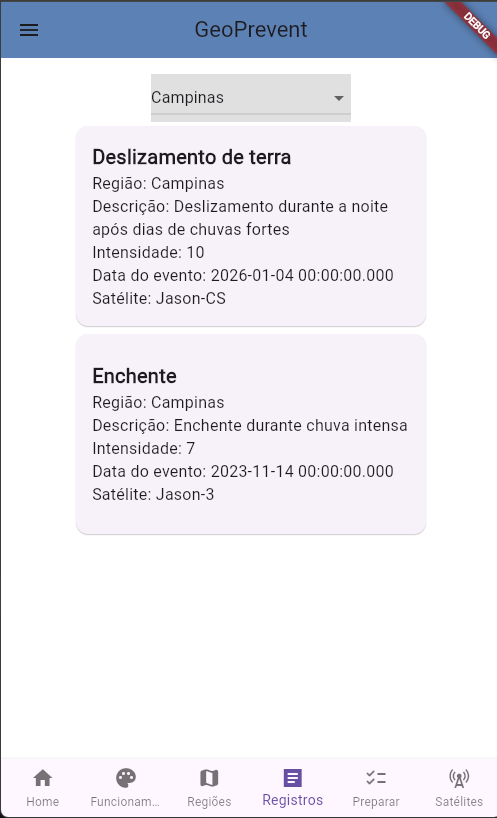
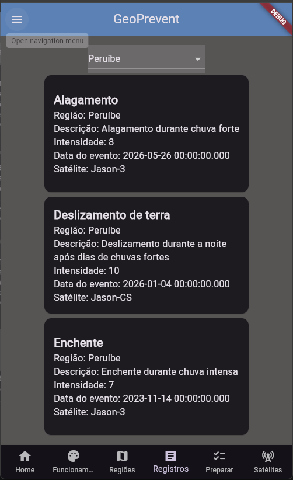

## Tela Preparar 

tela com checklist com items que você deve ter para se prepara caso algum desastre aconteça, conforme você for marcando os items com o check ele mostra o progresso numa barra de progresso além de mostrar a porcentagem dela

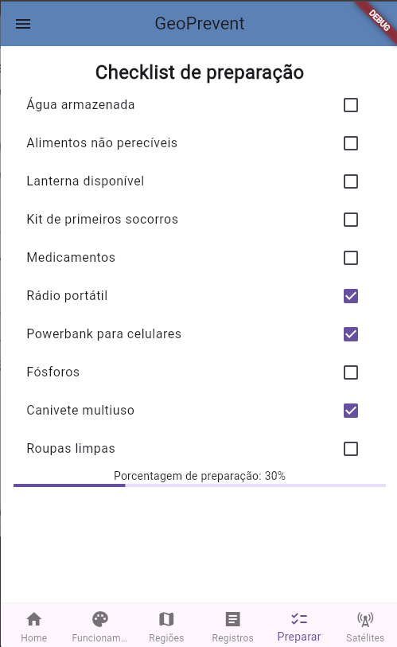
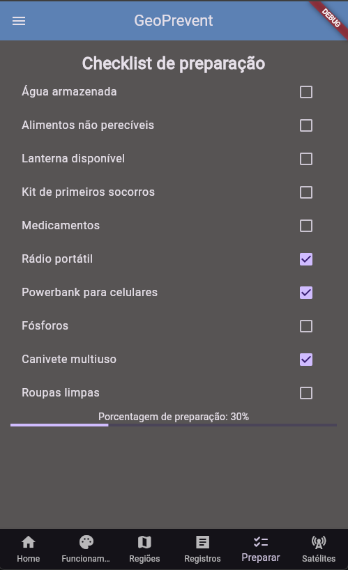

## Tela satelites

tela mostra os registro que cada satélite captou, tendo um radioListTile para mudar entre os dois satelites que existem Jason-3 e Jason-CS 

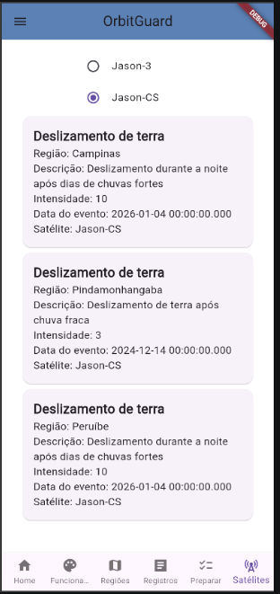
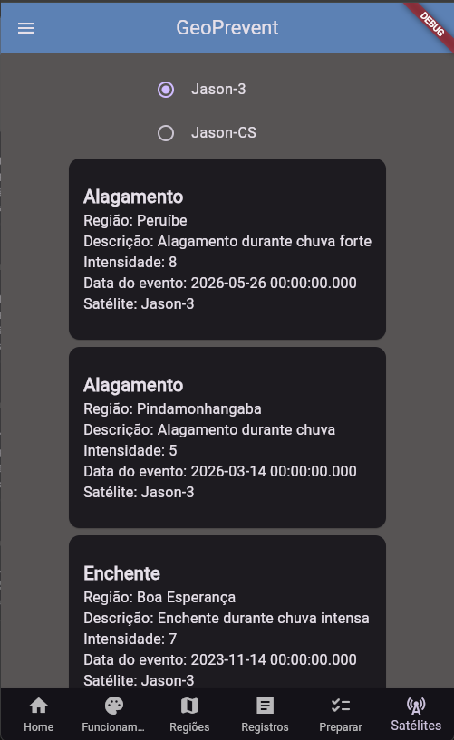